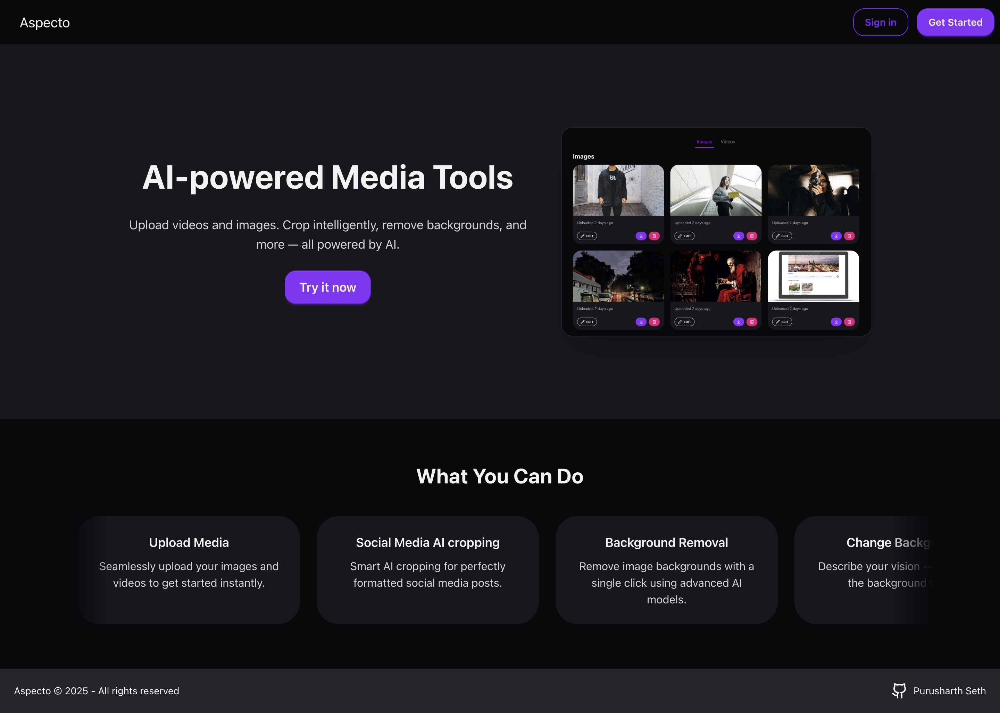
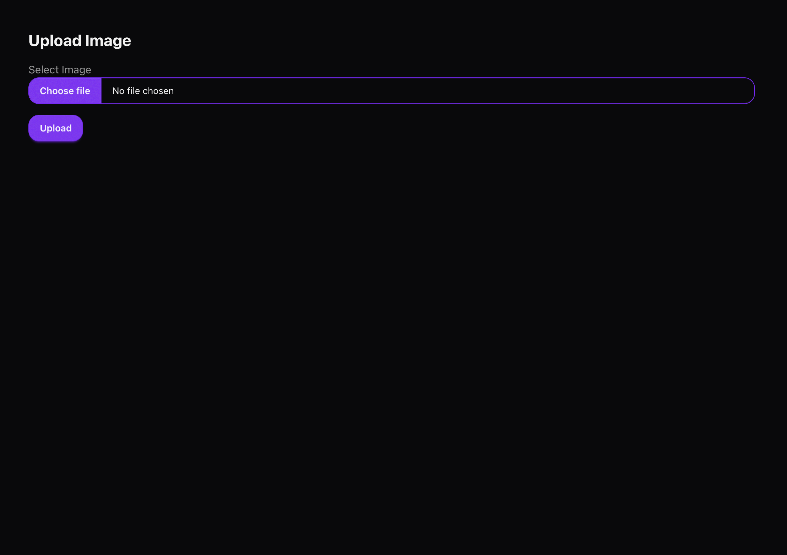
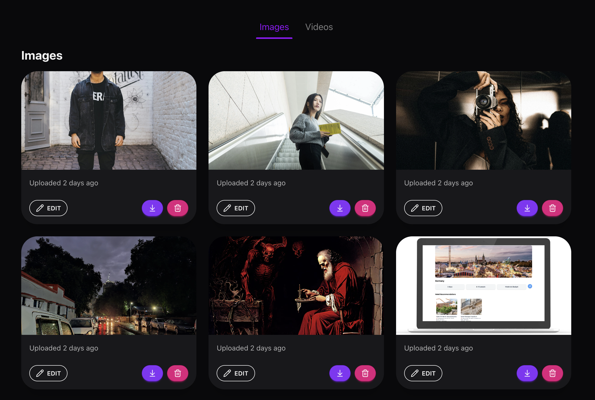

# 🖼️ Aspecto

**Full-stack Media Management App**
**deployed at:** https://aspecto-drab.vercel.app/

---

## ⚙️ Tech Stack
- **Next.js**
- **Cloudinary AI**
- **Clerk**
- **Prisma**
- **NeonDB**

---

## 📌 Overview
**Aspecto** is a modern media management platform designed to help users effortlessly enhance and prepare images and videos for social media. It leverages **AI-driven tools** to optimize visual content with minimal user input.

---

## ✨ Features

### 🎨 AI-Powered Enhancements
- Intelligent cropping for optimal social media display  
- Background removal and generative background replacement  
- Object removal and replacement available
- Smart preview for video

### 🔐 Secure Authentication
- Implemented with **Clerk** for seamless sign-up/sign-in  

### 💾 Data Management
- User data stored securely using **Prisma ORM** and **NeonDB**

---

## 🚀 Getting Started

- First login or create account if not created already
- Then go to uploading image/video, and upload image/video.

- Now after uploading image, you can visit home/videos or home/images.
- In videos you can have a smart preview, delete, and the size by which it has been compressed. This works as your cloud storage.
- In images you have an edit option with multiple functionalities.

- Then you can perform multiple operations, all powered by AI.